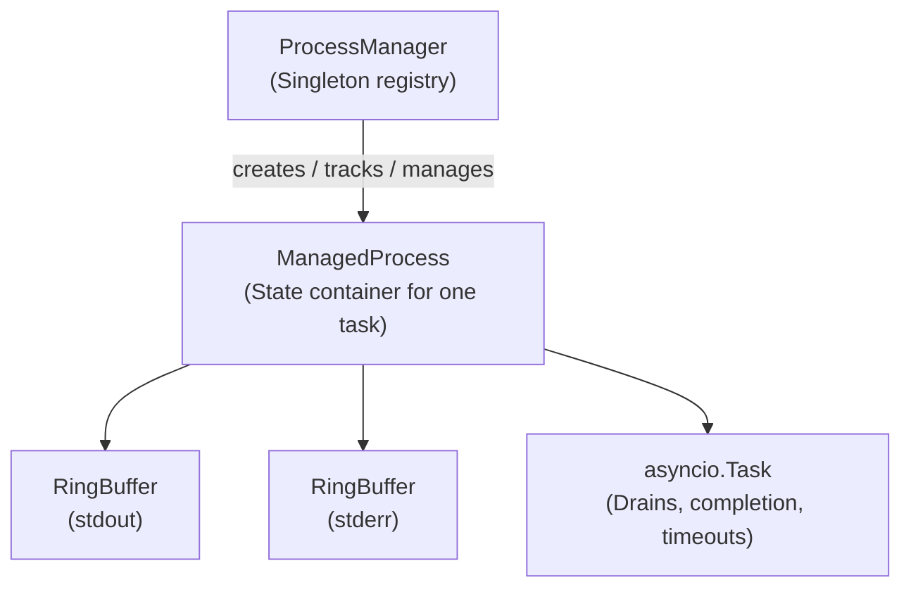

# Repository Guidelines & Developer Architecture

This document provides developer-facing guidelines, architectural overviews, and styling rules for `mcp-yieldshell`.

---

## Architectural Design & Components

The server uses an asynchronous model designed to manage subprocess lifecycles, redirect output streams, and avoid blocking the MCP communication channel.

### Key Components

*   **`ProcessManager`** (`src/mcp_yieldshell/process/manager.py`):
    *   Acts as the central registry tracking active and completed processes in a dictionary mapped by unique IDs (`proc_<hex>`).
    *   Implements the core MCP tool logic (`exec_command`, `read_output`, `write_input`, `wait_process`, `stop_process`, `list_processes`, `cleanup`).
    *   `exec_command` enforces the required `side_effects` declaration (see `src/mcp_yieldshell/types.py`) before cwd validation, command policy evaluation, process-limit checks, environment overlay building, and subprocess spawn.
    *   `wait_process` caps its effective wait at `MAX_EFFECTIVE_WAIT_MS` (55 s) to avoid MCP request timeouts.
*   **`ManagedProcess`** (`src/mcp_yieldshell/process/manager.py`):
    *   Groups the underlying `asyncio.subprocess.Process` handle with its stdout/stderr buffers, status, and active control tasks.
*   **`RingBuffer`** (`src/mcp_yieldshell/process/ring_buffer.py`):
    *   Maintains a fixed-size, byte-capped buffer for stdout and stderr to avoid unbounded memory growth.
    *   Tracks sequence numbers for chunks of bytes. Readers query the buffer with `since_seq` to retrieve incremental logs.
*   **`SideEffect`** (`src/mcp_yieldshell/types.py`):
    *   String enum of the canonical side-effect categories a command can declare. Shared with config parsing, MCP schema generation, and runtime validation.
    *   Default blocked set: `KILLS_AGENT_PROCESS`, `MODIFIES_OS_SETTINGS`, `MODIFIES_OS_USER_SETTINGS`, `MODIFIES_PROTECTED_FILES`, `RUNS_INLINE_CODE`. Configurable via `MCP_YIELDSHELL_BLOCKED_SIDE_EFFECTS`.

---

## Asynchronous Lifecycles & Task Scheduling

Whenever a command is executed, `ProcessManager` schedules several async tasks:

1.  **Draining Tasks** (`drain-stdout`, `drain-stderr`): Running concurrently, these tasks read from the subprocess pipes in 4KB chunks and write directly to the corresponding `RingBuffer`. They must complete draining before a process is marked as fully completed.
2.  **Completion Tracker** (`completion-<id>`): Waits for the process to exit using `await proc.wait()`, waits for outstanding drain tasks to finish, and sets the final exit code, signal info, and state transitions.
3.  **Timeout Handler** (`timeout-<id>`): Scheduled if `timeout_ms` is set. After sleeping, if the process is still running, it escalates from `SIGTERM` (graceful) to `SIGKILL` (forced) to clean up hung tasks. To prevent resource leaks, this task is cancelled immediately once the process exits naturally or is stopped.

---

## Platform-Specific Process Group Management

*   **POSIX**: To ensure that child processes launched by commands are fully cleaned up (and not orphaned), commands are spawned with `start_new_session=True` (`src/mcp_yieldshell/process/spawn.py`).
    *   Process signals are sent via `os.killpg(os.getpgid(pid), signal)` to terminate the entire process group.
*   **Windows**: Spawning utilizes standard `asyncio.create_subprocess_shell` parameters. Process group termination is not natively supported via POSIX signals, so process termination is best-effort and acts on the primary PID.

---

## Project Structure & Module Organization

This is a Python 3.11 package using a `src/` layout:
*   `src/mcp_yieldshell/server.py` and `__main__.py` contain the MCP server wiring and CLI entry points.
*   `src/mcp_yieldshell/config.py` handles environment-based configuration parsing, including the `MCP_YIELDSHELL_BLOCKED_SIDE_EFFECTS` blocklist.
*   `src/mcp_yieldshell/types.py` defines the `SideEffect` enum, default blocked set, and process status types.
*   `src/mcp_yieldshell/security.py` controls allowed path roots, command regex rules, and environment overlays/redactions.
*   `src/mcp_yieldshell/process/` contains execution, buffer, and lifecycle management.
*   `tests/` mirrors the code structure (e.g. `test_config.py`, `test_ring_buffer.py`, `test_security.py`, `test_integration.py`, `test_side_effects.py`).
*   `scripts/release.py` automates version bumps, lock refresh, staging, commit, tag, and push.

---

## Build, Test, and Development Commands

*   `uv sync`: Install runtime and development dependencies from `pyproject.toml` and `uv.lock`.
*   `uv run mcp-yieldshell`: Run the MCP server locally using stdio.
*   `uv run pytest`: Run the full test suite.
*   `uv run ruff check .`: Lint imports and check style rules.
*   `uv run pyright`: Run static type-checking.
*   `uv build`: Build wheel and source distributions.
*   `python scripts/release.py [patch|minor|major|<version>] [-y|--yes]`: Bumps version in `pyproject.toml`, refreshes `uv.lock` (via `uv lock`), stages both files, commits, tags, and pushes. The script aborts before commit/tag/push if `uv.lock` is missing or the lock refresh fails.

---

## Coding Style & Naming Conventions

*   Use **4-space indentation** and standard Python naming conventions (`snake_case` for variables/functions, `PascalCase` for classes, uppercase for constants).
*   Lines are capped at **99 characters** (configured in `tool.ruff`).
*   Keep modules focused around their distinct responsibilities; avoid creating generic "utility" files.

---

## Testing Guidelines

*   Tests use `pytest` with `pytest-asyncio`. Async tests are supported automatically by the `asyncio_mode = "auto"` configuration.
*   Name new test files `test_<area>.py` and test functions `test_<expected_behavior>`.
*   Add tests for any edge cases introduced, specifically: process state transitions, timeouts, output truncation, CWD policy, command security checks, side-effect validation, and release script lock refresh/staging behavior.

---

## Commit & Pull Request Guidelines

*   Commit messages follow Conventional Commit-style prefixes (e.g. `feat:`, `fix:`, `build:`, `chore:`).
*   Keep commit subjects imperative and focused on a single logical change.
*   Pull requests should list running/tested cases, linked issues, and notes on security impact.
