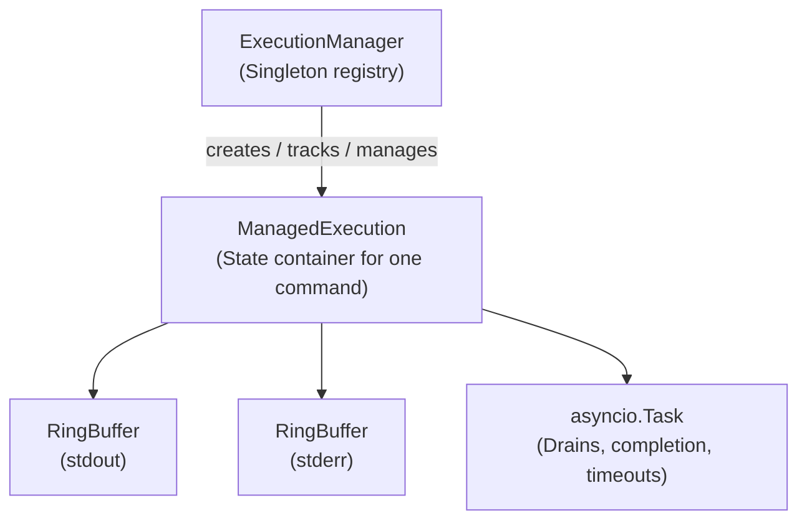

# Repository Guidelines & Developer Architecture

This document provides developer-facing guidelines, architectural overviews, and styling rules for `mcp-yieldshell`.

---

## Architectural Design & Components

The server uses an asynchronous model designed to manage execution lifecycles,
redirect subprocess output streams, and avoid blocking the MCP communication
channel.

```mermaid
graph TD
    EM["ExecutionManager<br>(Singleton registry)"] -->|creates / tracks / manages| ME["ManagedExecution<br>(State container for one command)"]
    ME --> RB_OUT["RingBuffer<br>(stdout)"]
    ME --> RB_ERR["RingBuffer<br>(stderr)"]
    ME --> AT["asyncio.Task<br>(Drains, completion, timeouts)"]
```

### Terminology

* **Execution**: one managed command invocation and all retained lifecycle state.
* **Execution ID (`execution_id`)**: opaque server-generated handle; pass it
  through unchanged.
* **Process ID (`process_id`)**: numeric OS PID of the initial shell.
* **Process group (`process_group_id`)**: OS group containing that shell and
  descendants.

### Key Components

* **`ExecutionManager`** (`src/mcp_yieldshell/execution/manager.py`):
  * Acts as the central registry tracking active and completed executions in
    `_executions`, keyed by opaque execution IDs.
  * Implements the core MCP tool logic (`execute_command`,
    `read_execution_output`, `write_input`, `wait_execution`,
    `stop_execution`, `list_executions`, `cleanup`).
  * `execute_command` enforces the required `side_effects` declaration (see `src/mcp_yieldshell/types.py`) before cwd validation, command policy evaluation, process-limit checks, environment overlay building, and subprocess spawn.
  * `wait_execution` caps its effective wait at `MAX_EFFECTIVE_WAIT_MS` (55 s) to avoid MCP request timeouts, and reports the outcome as `wait_result` (`exited` / `deadline_reached`) alongside `waited_ms` and the effective `max_wait_ms`.
  * `wait_execution` gates on `_await_live_work_end`, not on
    `completion_event` directly. The event latches when the tracked shell
    exits, which can happen while descendants still hold the process group
    open; waiting on it alone returns instantly on every call while the
    execution still reports `running`. `execute_command` deliberately keeps
    waiting on the raw event so launching a daemon still auto-yields promptly.
* **`ManagedExecution`** (`src/mcp_yieldshell/execution/managed.py`):
  * Groups the underlying `asyncio.subprocess.Process` handle with the
    execution's stdout/stderr buffers, status, and active control tasks.
  * On Linux, retains a random internal environment token used to discover
    ordinary descendants that explicitly leave the original process group.
  * Tracks `last_output_at` for idle reporting and exposes `latest_seq`, the shared cursor position just past the newest captured byte.
* **`RingBuffer`** (`src/mcp_yieldshell/execution/ring_buffer.py`):
  * Maintains a fixed-size, byte-capped buffer for stdout and stderr to avoid unbounded memory growth. Capacity comes from `YIELDSHELL_MAX_BUFFER_BYTES` (256 KB default) and is intentionally decoupled from the per-response cap `YIELDSHELL_MAX_OUTPUT_BYTES` (20 KB default), so a cursor stays resolvable across polling gaps.
  * Tracks shared byte-position cursors across stdout and stderr. Readers query the buffer with `since_seq` to retrieve lossless incremental logs, including responses capped inside an original drain chunk.
  * Reads report withheld output as two independent flags: `capped` (the response does not carry everything available; remainder still readable) and `evicted` (data aged out of the buffer; unrecoverable). `tail_start_seq` resolves a `tail_lines` request to a cursor and then delegates to `read_buffers`, reusing its ordering and UTF-8 boundary handling.
  * Byte positions start at 1, are unique for an execution record's lifetime,
    and are never reset — not by eviction, which only advances the oldest
    retained position, and not by `clear()`. A cursor aimed at evicted data
    resolves to the earliest retained position with `evicted` set rather than
    erroring.
  * `ExecutionManager._read_for_response` resumes cursorless reads from `ManagedExecution.read_cursor` and then advances it, so callers can poll without tracking `next_seq`. Requests carrying an explicit `since_seq`, a `tail_lines` tail, or a narrowed `streams` selection are out-of-band: they neither read nor write that cursor. Narrowed selections must stay out-of-band because `next_seq` would otherwise advance the shared cursor past bytes on the excluded stream.
* **`SideEffect`** (`src/mcp_yieldshell/types.py`):
  * String enum of the canonical side-effect categories a command can declare. Shared with config parsing, MCP schema generation, and runtime validation.
  * Default blocked set: `KILLS_AGENT_PROCESS`, `MODIFIES_OS_SETTINGS`, `MODIFIES_OS_USER_SETTINGS`, `MODIFIES_PROTECTED_FILES`, `RUNS_INLINE_CODE`. Configurable via `MCP_YIELDSHELL_BLOCKED_SIDE_EFFECTS`.
  * Runtime declaration validation and blocked-category guidance live in `src/mcp_yieldshell/side_effects.py`.

---

## Asynchronous Lifecycles & Task Scheduling

Whenever a command is executed, `ExecutionManager` schedules several async tasks:

1. **Draining Tasks** (`drain-stdout-<execution_id>`,
   `drain-stderr-<execution_id>`): Running concurrently, these tasks read from
   subprocess pipes in 4KB chunks, decode UTF-8 incrementally, optionally
   redact secrets selected by `YIELDSHELL_REDACT_ENV_REGEX` across chunk
   boundaries, and write bytes to the corresponding `RingBuffer`. Each chunk
   stamps `ManagedExecution.last_output_at`.
2. **Completion Tracker** (`completion-<execution_id>`): Waits for the initial
   shell with `await proc.wait()`, drains output, and sets the execution's
   final exit code, signal information, and status.
3. **Timeout Handler** (`timeout-<execution_id>`): Scheduled if `timeout_ms`
   is set. It escalates from `SIGTERM` to `SIGKILL` for the OS process group.
4. **Server Shutdown Path**: `ExecutionManager.shutdown()` is invoked from the FastMCP lifespan finally block (`src/mcp_yieldshell/server.py`) and is responsible for idempotently terminating all live process groups with a bounded graceful phase, force-killing survivors, draining final output, and settling completion tasks. Shutdown remains incomplete and retryable, and raises visibly, if a process group survives force-kill or a pending spawn does not settle after cancellation.

---

## Platform-Specific Process Group Management

* **POSIX**: To ensure that child processes launched by commands are fully cleaned up (and not orphaned), commands are spawned with `start_new_session=True` (`src/mcp_yieldshell/execution/spawn.py`).
  * The spawned PID is retained as the process-group ID (a new session leader's PGID equals its PID), and signals are sent with `os.killpg(pgid, signal)` to terminate the entire process group without a post-spawn lookup race.
  * On Linux, `execution/containment.py` adds an internal random environment
    token and uses procfs to keep ordinary re-sessioned or re-grouped
    descendants in lifecycle checks and signal fan-out. Commands that
    deliberately replace their inherited environment can evade this
    best-effort extension; YieldShell is not a security sandbox.
* **Windows**: Spawning utilizes standard `asyncio.create_subprocess_shell` parameters. Process group termination is not natively supported via POSIX signals, so process termination is best-effort and acts on the primary PID.

---

## Project Structure & Module Organization

This is a Python 3.11 package using a `src/` layout:
* `src/mcp_yieldshell/server.py` and `__main__.py` contain the MCP server wiring and CLI entry points.
* `src/mcp_yieldshell/policy.py` centralizes timing policy defaults and caps (`MAX_EFFECTIVE_WAIT_MS`, `GRACEFUL_STOP_MS`, etc.).
* `src/mcp_yieldshell/config.py` handles environment-based configuration parsing, including the `MCP_YIELDSHELL_BLOCKED_SIDE_EFFECTS` blocklist.
* `src/mcp_yieldshell/types.py` defines `ExecutionStatus`, `ExecutionInfo`,
  the `SideEffect` enum, and the default blocked set.
* `src/mcp_yieldshell/side_effects.py` validates declarations and formats blocked-category guidance.
* `src/mcp_yieldshell/security.py` controls allowed path roots, command regex rules, and environment overlays/redactions.
* `src/mcp_yieldshell/execution/` contains managed-execution state, buffering,
  process-spawn and Linux containment helpers, and lifecycle management.
* `tests/` mirrors the code structure (e.g. `test_config.py`, `test_ring_buffer.py`, `test_security.py`, `test_integration.py`, `test_side_effects.py`, `test_lifecycle_hardening.py`).
* `scripts/release.py` automates transactional version/lock refresh, scoped staging and commit, tagging, and an atomic branch/tag push. A rerun can resume after either tag creation or the final push failed following a successful release commit.

---

## Build, Test, and Development Commands

* `uv sync`: Install runtime and development dependencies from `pyproject.toml` and `uv.lock`.
* `uv run mcp-yieldshell`: Run the MCP server locally using stdio.
* `uv run pytest`: Run the full test suite.
* `uv run ruff check .`: Lint imports and check style rules.
* `uv run pyright`: Run static type-checking.
* `uv build`: Build wheel and source distributions.
* `python scripts/release.py [patch|minor|major|<version>] [-y|--yes]`: Bumps version in `pyproject.toml`, refreshes `uv.lock` (via `uv lock`), stages both files, commits, tags, and pushes. The script aborts before commit/tag/push if `uv.lock` is missing or the lock refresh fails.

---

## Coding Style & Naming Conventions

* Use **4-space indentation** and standard Python naming conventions (`snake_case` for variables/functions, `PascalCase` for classes, uppercase for constants).
* Keep modules focused around their distinct responsibilities; avoid creating generic "utility" files.
* Files exceeding 1000 lines or 8k tokens should be refactored into multiple modules.

---

## Testing Guidelines

* Tests use `pytest` with `pytest-asyncio`. Async tests are supported automatically by the `asyncio_mode = "auto"` configuration.
* Name new test files `test_<area>.py` and test functions `test_<expected_behavior>`.
* Add tests for any edge cases introduced, specifically: execution state
  transitions and identifier contracts, timeouts, output truncation,
  incremental cursors and tail reads, wait deadline accounting, CWD policy,
  command security checks, side-effect validation, and release script lock
  refresh/staging behavior.

---

## Commit & Pull Request Guidelines

* Commit messages follow Conventional Commit-style prefixes (e.g. `feat:`, `fix:`, `build:`, `chore:`).
* Keep commit subjects imperative and focused on a single logical change.
* Pull requests should list running/tested cases, linked issues, and notes on security impact.
