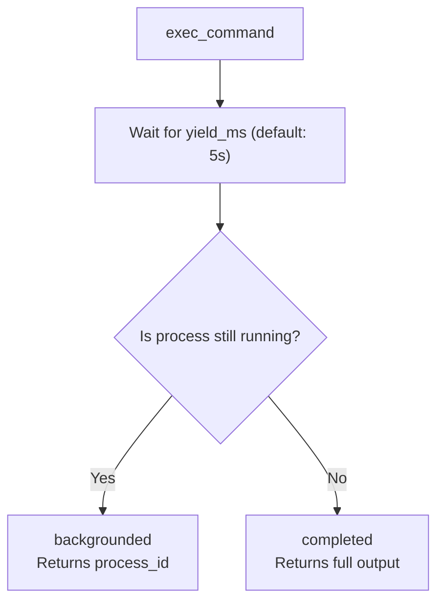

# YieldShell MCP

A drop-in shell MCP server that auto-yields long-running commands into managed background processes.

## Why Auto-Yielding?

Most shell tools present a frustrating choice: either block the LLM agent until the command finishes, or force the agent to decide upfront that a command should run in the background.

**YieldShell MCP** solves this by keeping normal foreground semantics for fast commands, then automatically promoting long-running commands into managed background processes after a brief delay (`yield_ms`, default: 5 seconds).



- **Fast Commands** (e.g., `echo hello`, `ls`): Complete instantly, returning the output immediately.
- **Long-Running Commands** (e.g., `npm run dev`, `docker build`, `sleep 60`): Automatically yield control back to the agent with a `process_id` and a snapshot of initial output, letting the agent decide when to `read`, `wait`, or `stop` the process.

---

## Installation

### From Registry (Recommended)

To run the published package via `uv`:

```bash
uv tool install mcp-yieldshell
```

### Local Development

To clone and run locally:

```bash
git clone <repo-url> && cd mcp-yieldshell
uv sync
uv run mcp-yieldshell
```

---

## MCP Client Configuration

### Claude Desktop

To configure the server in Claude Desktop, add the configuration below to your Claude Desktop config file:

*   **macOS**: `~/Library/Application Support/Claude/claude_desktop_config.json`
*   **Windows**: `%APPDATA%\Claude\claude_desktop_config.json`

#### Production (via uvx)

```json
{
  "mcpServers": {
    "yieldshell": {
      "command": "uvx",
      "args": ["mcp-yieldshell"]
    }
  }
}
```

#### Production with Security Restrictions

```json
{
  "mcpServers": {
    "yieldshell": {
      "command": "uvx",
      "args": ["mcp-yieldshell"],
      "env": {
        "YIELDSHELL_ALLOWED_CWDS": "/home/user/projects:/tmp/build",
        "YIELDSHELL_DEFAULT_TIMEOUT_MS": "300000"
      }
    }
  }
}
```

#### Local Development Setup

Replace `/path/to/mcp-yieldshell` with the absolute path to your cloned repository:

```json
{
  "mcpServers": {
    "yieldshell": {
      "command": "uv",
      "args": [
        "--directory",
        "/path/to/mcp-yieldshell",
        "run",
        "mcp-yieldshell"
      ]
    }
  }
}
```

### Cursor

To configure the server in Cursor:
1. Open **Cursor Settings** -> **Features** -> **MCP**.
2. Click **+ Add New MCP Server**.
3. Fill out the form:
   - **Name**: `yieldshell`
   - **Type**: `stdio`
   - **Command**: `uvx mcp-yieldshell` (or `uv --directory /path/to/mcp-yieldshell run mcp-yieldshell` for local development)

### OpenCode

Add to your OpenCode MCP settings:

```json
{
  "mcpServers": {
    "yieldshell": {
      "command": "uvx",
      "args": ["mcp-yieldshell"]
    }
  }
}
```

---

## Tool Reference

### `exec`
Execute a shell command. If the command runs longer than `yield_ms`, it yields a `process_id` and runs in the background.

*   **Parameters**:
    *   `command` (string, **required**): The command string to execute in the shell.
    *   `side_effects` (array of string, **required**): The side-effect categories this command may plausibly have. Must contain at least one entry drawn from the enum below. Use `["NONE"]` for commands with no meaningful side effects. `NONE` is exclusive and must not be combined with any other category. The server rejects the call with `failed_to_start` if any declared category is configured as blocked.
        *   Allowed values: `NONE`, `MODIFIES_WORKSPACE_FILES`, `MODIFIES_PROTECTED_FILES`, `MODIFIES_OUTSIDE_WORKSPACE`, `DELETES_FILES`, `INSTALLS_DEPENDENCIES`, `CHANGES_SYSTEM_CONFIGURATION`, `BREAKS_OPERATING_SYSTEM`, `AFFECTS_PRODUCTION_SERVICES`, `STOPS_OR_RESTARTS_SERVICES`, `EXPOSES_SECRETS`, `CREATES_SECURITY_RISK`, `CHANGES_NETWORK_CONFIGURATION`, `MAKES_NETWORK_REQUESTS`, `RUNS_PRIVILEGED_COMMANDS`, `USES_DESTRUCTIVE_GIT_OPERATION`, `CONSUMES_SIGNIFICANT_RESOURCES`, `GENERATES_EXECUTABLE_CONTENT`, `BREAKS_OS_USER_SETTINGS`, `KILLS_AGENT_PROCESS`, `OTHER`, `UNKNOWN`.
        *   `GENERATES_EXECUTABLE_CONTENT` is in the default blocklist. It covers opaque inline content that is difficult to inspect before execution: long generated code, scripts, shell pipelines, SQL, configuration, heredocs, encoded payloads, and generated files executed immediately. The safer next action is to write the content to a reviewable workspace file and execute it in a small, inspectable step. Operators can unblock the category via `MCP_YIELDSHELL_BLOCKED_SIDE_EFFECTS=`.
    *   `cwd` (string, optional): Working directory for the command. Must be under allowed roots if `YIELDSHELL_ALLOWED_CWDS` is set. Defaults to `YIELDSHELL_DEFAULT_CWD`.
    *   `env` (object of string to string, optional): Additive environment variable overlay. Merged into the parent environment.
    *   `shell` (string, optional): Accepted but has no effect in v1. Commands always run via the platform's default shell.
    *   `stdin` (string, optional): Initial text input written to standard input immediately after spawning.
    *   `name` (string, optional): A human-readable label/name to identify this process.
    *   `yield_ms` (integer, optional): Milliseconds to wait before yielding execution to background. Clamped by `YIELDSHELL_MAX_YIELD_MS`. Defaults to `YIELDSHELL_DEFAULT_YIELD_MS` (5000ms).
    *   `timeout_ms` (integer, optional): Total execution runtime limit in milliseconds. Process is killed if it runs longer than this. Defaults to `YIELDSHELL_DEFAULT_TIMEOUT_MS` (0 = no limit).
    *   `max_output_bytes` (integer, optional): Maximum output bytes to capture in stdout/stderr ring buffers. Subject to `YIELDSHELL_MAX_OUTPUT_BYTES` cap.

*   **Side-Effects Guide**:
    *   `side_effects` is required and must be a non-empty list. Declare every plausible side-effect category before running the command.
    *   `NONE` is exclusive and valid only when no meaningful side effect is expected. Use `["NONE"]` for read-only commands.
    *   The server rejects the call with `failed_to_start` if any declared category is blocked. Rejection runs before cwd validation, command policy, process-limit checks, env construction, and spawn.
    *   Rejection messages name each blocked category, state that execution was stopped by policy before the process started, and provide a category-specific safer next action.
    *   Categories are case-sensitive and must use the canonical enum names listed above.
    *   **Discouraged**: piping or inlining large generated code, scripts, shell pipelines, SQL, configuration, heredocs, encoded payloads, or generated files executed immediately into a single `exec` call. Agents should prefer writing such content to a reviewable workspace file and executing it in a small, inspectable step with explicit matching `side_effects`. Declaring `GENERATES_EXECUTABLE_CONTENT` is rejected under the default policy.

*   **Side-Effect Examples**:
    *   Read-only command: `side_effects=["NONE"]`
    *   Workspace write: `side_effects=["MODIFIES_WORKSPACE_FILES"]`
    *   Dependency install: `side_effects=["INSTALLS_DEPENDENCIES", "MAKES_NETWORK_REQUESTS"]`
    *   Network access: `side_effects=["MAKES_NETWORK_REQUESTS"]`
    *   Destructive file operations: `side_effects=["DELETES_FILES"]`
    *   Privileged command: `side_effects=["RUNS_PRIVILEGED_COMMANDS"]`
    *   Protected-file changes: `side_effects=["MODIFIES_PROTECTED_FILES"]`
    *   Inline generated content: prefer writing the content to a reviewable workspace file (for example `scripts/migrate.sql` or `tools/build.sh`) and run it in a small, inspectable step. Declaring `side_effects=["GENERATES_EXECUTABLE_CONTENT"]` is rejected under the default policy; operators can clear that default with `MCP_YIELDSHELL_BLOCKED_SIDE_EFFECTS=`.

*   **Output Statuses**:
    *   `completed`: Process finished within `yield_ms`. Returns exit code, stdout, and stderr.
    *   `backgrounded`: Process auto-yielded. Returns `process_id`, `pid`, a snapshot of initial stdout/stderr, `duration_ms`, `truncated`, and a `message` string describing that the process is running in the background.
    *   `timed_out`: Process exceeded `timeout_ms` and was terminated.
    *   `stopped`: Process was explicitly terminated.
    *   `failed_to_start`: Command could not be spawned (e.g., bad directory or policy violation).
    *   `failed`: An internal execution error occurred.

### `read`
Read stdout and/or stderr output from a running or completed background process.

*   **Parameters**:
    *   `process_id` (string, **required**): Unique identifier of the process.
    *   `since_seq` (integer, optional): Return only output appended after this sequence number. Enables efficient incremental log polling.
    *   `max_output_bytes` (integer, optional): Clamps the response size. Defaults to the server cap.
    *   `streams` (string, default: `"both"`): The streams to read. Options: `"both"`, `"stdout"`, or `"stderr"`.

*   **Returns**:
    *   `process_id`, `status`, `exit_code`, `signal`, `next_seq` (sequence index to use in subsequent `since_seq` reads), `truncated` flag. `stdout` and `stderr` text are included based on the `streams` filter — `"both"` includes both, `"stdout"` includes only `stdout`, and `"stderr"` includes only `stderr`.

### `write`
Write text input to the standard input (`stdin`) of a running process.

*   **Parameters**:
    *   `process_id` (string, **required**): Unique identifier of the process.
    *   `input` (string, **required**): Text input to write.
    *   `newline` (boolean, default: `false`): If `true`, appends `\n` to the input.

### `wait`
Block execution until the process exits or the wait timeout expires. This allows the LLM to pause and await completion without spawning a new execution loop.

*   **Parameters**:
    *   `process_id` (string, **required**): Unique identifier of the process.
    *   `timeout_ms` (integer, default: `30000`): Maximum time to wait.
    *   `max_output_bytes` (integer, optional): Maximum output bytes to return in the response.

*   **Important**: If the wait timeout expires, `wait` returns the current status but **does not kill** the process. It continues running in the background.
*   The effective wait duration is capped at 55 seconds to stay well under typical MCP request timeouts, even if a larger `timeout_ms` is requested.
*   `wait` treats the tracked shell process exiting as completion. For normal process completion, stdout/stderr are drained before the response is returned. If descendant processes keep inherited pipes open after the tracked process exits, the server closes its drain tasks so `wait` can complete without blocking indefinitely.

### `stop`
Gracefully terminate or force kill a running process.

*   **Parameters**:
    *   `process_id` (string, **required**): Unique identifier of the process.
    *   `signal` (string, default: `"SIGTERM"`): OS signal to send (e.g. `SIGTERM`, `SIGKILL`, `SIGINT`). Ignored on Windows.
    *   `force_after_ms` (integer, default: `3000`): Grace period before escalating to force kill (`SIGKILL`).

### `ps`
List all managed processes.

*   **Parameters**:
    *   `include_completed` (boolean, default: `true`): If `false`, finished/stopped processes are excluded from the output.
    *   `limit` (integer, default: `50`): Maximum number of entries.
*   **Returns**: `processes` — a list of process summary objects, each containing: `process_id`, `pid`, `name`, `command`, `cwd`, `status`, `exit_code`, `signal`, `started_at`, `ended_at`, `duration_ms`, `stdout_bytes`, `stderr_bytes`.

### Error Responses

All tools that accept a `process_id` parameter return a structured error dict when the ID is unknown, e.g. `{"process_id": "proc_abc123", "error": "Unknown process_id: proc_abc123"}`. Tools that accept `process_id` always include it in the response alongside the error.

### `cleanup`
Prune completed or stopped process records to free memory.

*   **Parameters**:
    *   `completed_older_than_ms` (integer, default: `3600000`): Prunes completed processes older than this threshold (1 hour default).
    *   `stopped_older_than_ms` (integer, default: `3600000`): Prunes stopped, timed-out, or failed processes older than this threshold (1 hour default).
*   **Returns**: `removed` — the count of process records that were pruned.

---

## Sequence Number & Incremental Reads

To avoid sending duplicate data over the MCP protocol (which can consume context window space), the server implements a sequence-based polling protocol:

1. Every output chunk appended to a process's ring buffer receives a unique, incremental sequence number (`seq`).
2. When calling `exec`, `read`, or `wait`, the response includes a `next_seq` value representing the index of the next chunk to be written.
3. To retrieve only *new* output, call `read` with `since_seq` set to the previously received `next_seq`.
4. Omitting `since_seq` returns the entire contents currently stored in the buffer (clamped by `max_output_bytes`).
5. If output exceeds the ring buffer's capacity between reads, older data is evicted and `since_seq` may no longer be available. In that case, `truncated` is set to `true` and the read returns data from the earliest retained sequence onward.

When a process exits normally, `exec`/`wait` responses include output drained through stdout/stderr EOF. If a descendant keeps inherited stdout/stderr open after the tracked process exits, the server stops waiting on those inherited pipes to avoid indefinite blocking; output written only by that descendant after the tracked process exits is not part of the managed process result.

---

## Configuration Variables

Configure the server by setting these environment variables prior to launch:

| Environment Variable | Default Value | Description |
|---|---|---|
| `YIELDSHELL_DEFAULT_CWD` | Current directory | The fallback working directory for commands. |
| `YIELDSHELL_ALLOWED_CWDS` | *(none)* | A list of allowed directory paths separated by `os.pathsep` (e.g., `:` on UNIX, `;` on Windows). If set, all command execution paths must resolve inside one of these roots. |
| `YIELDSHELL_MAX_OUTPUT_BYTES` | `20000` | The default and maximum capacity of the ring buffers for stdout/stderr. |
| `YIELDSHELL_MAX_PROCESSES` | `50` | Maximum concurrent running processes. Completed, stopped, timed-out, and failed processes do not count against this limit. Spawning a new command when this limit is reached will return `failed_to_start`. |
| `YIELDSHELL_DEFAULT_YIELD_MS` | `5000` | Fallback delay before auto-yielding. |
| `YIELDSHELL_MAX_YIELD_MS` | `300000` | The maximum allowed value for the `yield_ms` parameter. |
| `YIELDSHELL_DEFAULT_TIMEOUT_MS` | `0` | Default hard runtime limit (0 means no limit). |
| `YIELDSHELL_DENY_COMMAND_REGEX` | *(none)* | A regular expression pattern. Commands matching this pattern are blocked before starting. |
| `YIELDSHELL_ALLOW_COMMAND_REGEX` | *(none)* | A regular expression pattern. If set, only commands matching this pattern are permitted. |
| `YIELDSHELL_REDACT_ENV_REGEX` | `TOKEN\|KEY\|SECRET\|PASSWORD` | Regex to identify sensitive environment variable keys. Their values are redacted in stdout/stderr outputs. |
| `MCP_YIELDSHELL_BLOCKED_SIDE_EFFECTS` | `MODIFIES_PROTECTED_FILES,BREAKS_OPERATING_SYSTEM,GENERATES_EXECUTABLE_CONTENT,BREAKS_OS_USER_SETTINGS,KILLS_AGENT_PROCESS` | Comma-separated list of `side_effects` enum names the server should reject. Names are case-sensitive. Surrounding whitespace is trimmed and empty entries are ignored. Invalid names cause startup to fail. Set to `,` (or any value that resolves to no entries) to clear the default blocklist. |

---

## Security Notes

*   **Arbitrary Code Execution**: This server executes shell commands on the host system. Always run the server inside a container, sandbox, or isolated development VM.
*   **Side-Effect Declarations**: Every `exec` call must declare its plausible side-effect categories via `side_effects`. By default, `MODIFIES_PROTECTED_FILES`, `BREAKS_OPERATING_SYSTEM`, `GENERATES_EXECUTABLE_CONTENT`, `BREAKS_OS_USER_SETTINGS`, and `KILLS_AGENT_PROCESS` are blocked. Operators can adjust the blocklist via `MCP_YIELDSHELL_BLOCKED_SIDE_EFFECTS` (including cleared to `,` to disable every default). This is an explicit risk signal — it is not a complete sandbox, and LLM under-declaration remains possible.
*   **Inline Generated Content**: The `GENERATES_EXECUTABLE_CONTENT` default discourages agents from piping or inlining large generated code, scripts, shell pipelines, SQL, configuration, heredocs, encoded payloads, or generated files executed immediately into a single `exec` call. The safer pattern is to write the content to a reviewable workspace file and execute it in a small, inspectable step with explicit matching `side_effects`. Operators can override the default to permit the category.
*   **OS User Settings Damage**: `BREAKS_OS_USER_SETTINGS` covers commands that may damage or globally disrupt settings for the current OS user (e.g., overwriting shell rc files, changing system-wide user preferences, or altering login configuration). This is distinct from `BREAKS_OPERATING_SYSTEM`, which covers broader OS integrity damage. Blocked by default; operators can override.
*   **Agent Process Termination**: `KILLS_AGENT_PROCESS` covers commands that may terminate the MCP client, agent, or related process running the agent workflow (e.g., `kill` commands targeting the agent PID, or commands that cause the agent to exit). This is distinct from `STOPS_OR_RESTARTS_SERVICES`, which covers OS-level services. Blocked by default; operators can override.
*   **Path Validation**: CWD path verification uses absolute paths (`resolve()`), preventing path-traversal attacks (`../`) outside the allowed roots.
*   **Additive Environments**: The `env` argument overlays existing env parameters. It merges with the parent process environment instead of completely replacing it, protecting critical OS vars.
*   **Best-effort Redaction**: While values of variables matching `YIELDSHELL_REDACT_ENV_REGEX` are scrubbed from outputs, this is a best-effort system. Sensitive data printed through complex formats or argument lists might not be caught.

---

## Platform Support

*   **POSIX (Linux & macOS)**: Fully supported. Spawns processes in distinct sessions (`start_new_session=True`), allowing signals (`SIGTERM`/`SIGKILL`) to target the entire process group. This ensures child processes started by commands (such as npm dev tasks) are completely cleaned up.
*   **Windows**: Supported with best-effort process group controls. Windows lacks native POSIX signals, meaning `stop` and `timeout_ms` act on the primary process, and child subprocesses might persist if they do not exit cleanly.

---

## License

MIT