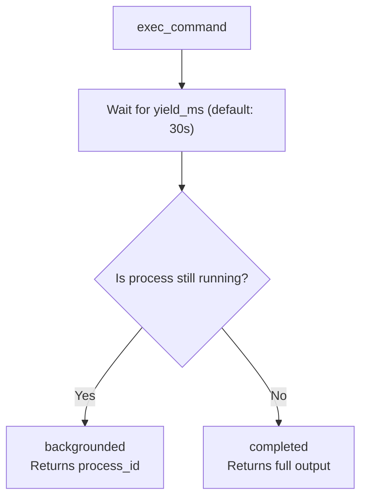

# YieldShell MCP

A drop-in shell MCP server that auto-yields long-running commands into managed background processes.

## Why Auto-Yielding?

Most shell tools present a frustrating choice: either block the LLM agent until the command finishes, or force the agent to decide upfront that a command should run in the background.

**YieldShell MCP** solves this by keeping normal foreground semantics for fast commands, then automatically promoting long-running commands into managed background processes after a delay (`yield_ms`, default: 30 seconds).


```mermaid
graph TD
    A[exec_command] --> B["Wait for yield_ms (default: 30s)"]
    B --> C{Is process still running?}
    C -->|Yes| D["backgrounded<br>Returns process_id"]
    C -->|No| E["completed<br>Returns full output"]
```

- **Fast Commands** (e.g., `echo hello`, `ls`): Complete instantly, returning the output immediately.
- **Long-Running Commands** (e.g., `npm run dev`, `docker build`, `sleep 60`): Automatically yield control back to the agent with a `process_id` and a snapshot of initial output, letting the agent decide when to `read`, `wait`, or `stop` the process.

---

## Installation

### From Registry (Recommended)

To run the published package via `uv`:

```bash
uv tool install mcp-yieldshell
```

### Local Development

To clone and run locally:

```bash
git clone <repo-url> && cd mcp-yieldshell
uv sync
uv run mcp-yieldshell
```

---

## MCP Client Configuration

### Claude Desktop

To configure the server in Claude Desktop, add the configuration below to your Claude Desktop config file:

* **macOS**: `~/Library/Application Support/Claude/claude_desktop_config.json`
* **Windows**: `%APPDATA%\Claude\claude_desktop_config.json`

#### Production (via uvx)

```json
{
  "mcpServers": {
    "yieldshell": {
      "command": "uvx",
      "args": ["mcp-yieldshell"]
    }
  }
}
```

#### Production with Security Restrictions

```json
{
  "mcpServers": {
    "yieldshell": {
      "command": "uvx",
      "args": ["mcp-yieldshell"],
      "env": {
        "YIELDSHELL_ALLOWED_CWDS": "/home/user/projects:/tmp/build",
        "YIELDSHELL_DEFAULT_TIMEOUT_MS": "300000"
      }
    }
  }
}
```

#### Local Development Setup

Replace `/path/to/mcp-yieldshell` with the absolute path to your cloned repository:

```json
{
  "mcpServers": {
    "yieldshell": {
      "command": "uv",
      "args": [
        "--directory",
        "/path/to/mcp-yieldshell",
        "run",
        "mcp-yieldshell"
      ]
    }
  }
}
```

### Cursor

To configure the server in Cursor:
1. Open **Cursor Settings** -> **Features** -> **MCP**.
2. Click **+ Add New MCP Server**.
3. Fill out the form:
  - **Name**: `yieldshell`
  - **Type**: `stdio`
  - **Command**: `uvx mcp-yieldshell` (or `uv --directory /path/to/mcp-yieldshell run mcp-yieldshell` for local development)

### OpenCode

Add to your OpenCode MCP settings:

```json
{
  "mcpServers": {
    "yieldshell": {
      "command": "uvx",
      "args": ["mcp-yieldshell"]
    }
  }
}
```

---

## Tool Reference

### `exec`
Execute a shell command. If the command runs longer than `yield_ms`, it yields a `process_id` and runs in the background.

* **Parameters**:
  * `command` (string, **required**): The command string to execute in the shell.
  * `side_effects` (array of string, **required**): The side-effect categories this command may plausibly have. Must contain at least one entry drawn from the enum below. Use `["NONE"]` for commands with no meaningful side effects. `NONE` is exclusive and must not be combined with any other category. The server rejects the call with `failed_to_start` if any declared category is configured as blocked.
    * Allowed values: `CHANGES_NETWORK_CONFIGURATION`, `CHANGES_PACKAGES_OR_DEPENDENCIES`, `CONSUMES_SIGNIFICANT_RESOURCES`, `DELETES_FILES`, `EXPOSES_SECRETS`, `KILLS_AGENT_PROCESS`, `MAKES_NETWORK_REQUESTS`, `MODIFIES_OS_SETTINGS`, `MODIFIES_OS_USER_SETTINGS`, `MODIFIES_OUTSIDE_WORKSPACE`, `MODIFIES_PRODUCTION_SERVICES`, `MODIFIES_PROTECTED_FILES`, `MODIFIES_SECURITY_CONTROLS`, `MODIFIES_WORKSPACE_FILES`, `NONE`, `OTHER`, `RUNS_INLINE_CODE`, `RUNS_PRIVILEGED_COMMANDS`, `STOPS_OR_RESTARTS_SERVICES`, `UNKNOWN`, `USES_DESTRUCTIVE_GIT_OPERATION`.
    * `RUNS_INLINE_CODE` is in the default blocklist. It covers commands that execute code supplied inline to an interpreter or shell (e.g. `python -c`, `node -e`, `curl ... | sh`). It does not cover simply creating a script or executable file unless the same command also executes inline code. The safer next action is to write the content to a reviewable workspace file and execute it in a small, inspectable step. Operators can clear the blocklist via `MCP_YIELDSHELL_BLOCKED_SIDE_EFFECTS=,`.
  * `cwd` (string, optional): Working directory for the command. Must be under allowed roots if `YIELDSHELL_ALLOWED_CWDS` is set. Defaults to `YIELDSHELL_DEFAULT_CWD`.
  * `env` (object of string to string, optional): Additive environment variable overlay. Merged into the parent environment.
  * `shell` (string, optional): Shell executable used to run the command. Defaults to the platform shell. Explicit shells are checked by the same allow/deny command policy.
  * `stdin` (string, optional): Initial text input written to standard input immediately after spawning.
  * `close_stdin` (boolean, default: `true`): Close standard input after the initial input is written. Set to `false` when follow-up `write` calls are expected.
  * `name` (string, optional): A human-readable label/name to identify this process.
  * `yield_ms` (integer, optional): Milliseconds to wait before yielding execution to background. Both omitted and explicit values are clamped to the lesser of `YIELDSHELL_MAX_YIELD_MS` and the transport-safe 55,000ms ceiling. Defaults to `YIELDSHELL_DEFAULT_YIELD_MS` (30,000ms).
  * `timeout_ms` (integer, optional): Total execution runtime limit in milliseconds. Process is terminated if it runs longer than this. Defaults to `YIELDSHELL_DEFAULT_TIMEOUT_MS` (3,600,000ms). Pass `0` explicitly for unlimited execution.
  * `max_output_bytes` (integer, optional): Maximum bytes returned in total across both response streams. Subject to the `YIELDSHELL_MAX_OUTPUT_BYTES` cap. This bounds the response only — retention is controlled separately by `YIELDSHELL_MAX_BUFFER_BYTES`, so output withheld here stays readable via `read`.

* **Side-Effects Guide**:
  * `side_effects` is required and must be a non-empty list. Declare every plausible side-effect category before running the command.
  * `NONE` is exclusive and valid only when no meaningful side effect is expected. Use `["NONE"]` for read-only commands.
  * The server rejects the call with `failed_to_start` if any declared category is blocked. Rejection messages name each blocked category, state that execution was stopped by policy before the process started, and provide a category-specific safer next action.
  * Categories are case-sensitive and must use the canonical enum names listed above.
  * **Discouraged**: executing code supplied inline to an interpreter or shell (e.g. `python -c`, `node -e`, `ruby -e`, `perl -e`, shell heredocs piped into interpreters, or `curl ... | sh`). Agents should prefer writing such content to a reviewable workspace file and executing it in a small, inspectable step with explicit matching `side_effects`. Declaring `RUNS_INLINE_CODE` is rejected under the default policy.

* **Side-Effect Examples**:
  * Read-only command: `side_effects=["NONE"]`
  * Workspace write: `side_effects=["MODIFIES_WORKSPACE_FILES"]`
  * Dependency install: `side_effects=["CHANGES_PACKAGES_OR_DEPENDENCIES", "MAKES_NETWORK_REQUESTS"]`
  * Network access: `side_effects=["MAKES_NETWORK_REQUESTS"]`
  * Destructive file operations: `side_effects=["DELETES_FILES"]`
  * Privileged command: `side_effects=["RUNS_PRIVILEGED_COMMANDS"]`
  * Protected-file changes: `side_effects=["MODIFIES_PROTECTED_FILES"]`
  * Inline code execution: prefer writing the content to a reviewable workspace file (for example `scripts/migrate.sql` or `tools/build.sh`) and run it in a small, inspectable step. Declaring `side_effects=["RUNS_INLINE_CODE"]` is rejected under the default policy; operators can clear that default with `MCP_YIELDSHELL_BLOCKED_SIDE_EFFECTS=,`.

* **Output Statuses**:
  * Every status returns the cursor fields described under [Byte Cursors & Incremental Reads](#byte-cursors--incremental-reads): `start_seq`, `next_seq`, `latest_seq`, `capped`, and `evicted`. Pass `next_seq` back as `since_seq` to continue reading without replaying output.
  * `completed`: Process finished within `yield_ms`. Returns exit code, stdout, and stderr. If output was withheld and terminal-process retention is enabled, it also returns `process_id` so the remainder can be inspected with `read`.
  * `backgrounded`: Process auto-yielded. Returns `process_id`, `pid`, a snapshot of initial stdout/stderr, `duration_ms`, the cursor fields, and a `message` string describing that the process is running in the background.
  * `timed_out`: Process exceeded `timeout_ms` and was terminated.
  * `stopped`: Process was explicitly terminated.
  * `failed_to_start`: Command could not be spawned (e.g., bad directory or policy violation).
  * `failed`: An internal execution error occurred.
  * If initial `stdin` delivery fails, responses for the retained process include
    `stdin_error` with the transport error. Initial delivery runs as tracked
    background work so pipe backpressure does not delay auto-yielding.

### `read`
Read stdout and/or stderr output from a running or completed background process.

* **Parameters**:
  * `process_id` (string, **required**): Unique identifier of the process.
  * `since_seq` (integer, optional): Byte-position cursor returned as `next_seq` by the previous read. Enables lossless incremental log polling.
  * `max_output_bytes` (integer, optional): Clamps total output returned across the selected streams. Defaults to the server cap.
  * `streams` (string, default: `"both"`): The streams to read. Options: `"both"`, `"stdout"`, or `"stderr"`.
  * `tail_lines` (integer, optional): Return only the newest N lines instead of reading forward. Useful for monitoring a noisy build or test run without paging through it. Mutually exclusive with `since_seq`; must be positive. If the requested tail exceeds `max_output_bytes`, the newest bytes are kept rather than the oldest.

* **Returns**:
  * `process_id`, `status`, `exit_code`, `signal`, and `stdin_error` when initial input delivery failed. `stdout` and `stderr` text are included based on the `streams` filter — `"both"` includes both, `"stdout"` includes only `stdout`, and `"stderr"` includes only `stderr`.
  * Cursor fields: `start_seq` (position of the first byte returned), `next_seq` (cursor to use in the next `since_seq` read), and `latest_seq` (how far output has advanced overall — when it exceeds `next_seq`, more is waiting).
  * Withheld-output flags: `capped` means the response cap stopped it short and the rest is still readable; `evicted` means output fell out of the ring buffer before it was read and cannot be recovered. When either is set, a `hint` field names the concrete follow-up call.

### `write`
Write text input to the standard input (`stdin`) of a running process.

* **Parameters**:
  * `process_id` (string, **required**): Unique identifier of the process.
  * `input` (string, **required**): Text input to write.
  * `newline` (boolean, default: `false`): If `true`, appends `\n` to the input.
  * `close_stdin` (boolean, default: `false`): Close standard input after this write, delivering EOF to the process.
* Writes that remain backpressured are capped at the transport-safe 55-second
  request ceiling and return `ok: false` with an error.

### `wait`
Block execution until the process exits or the wait timeout expires. This allows the LLM to pause and await completion without spawning a new execution loop.

* **Parameters**:
  * `process_id` (string, **required**): Unique identifier of the process.
  * `timeout_ms` (integer, default: `55000`): Maximum time to wait. Never terminates the process.
  * `max_output_bytes` (integer, optional): Maximum total output bytes to return across stdout and stderr.
  * `since_seq` (integer, optional): Byte-position cursor from a previous response. **Recommended when polling**: without it, every `wait` replays the buffer from the beginning and re-sends output the caller already has.
  * `tail_lines` (integer, optional): Return only the newest N lines. Mutually exclusive with `since_seq`.

* **Returns**: the same cursor and withheld-output fields as `read`, plus:
  * `wait_result`: `"exited"` when no live work remains, or `"deadline_reached"` when the wait budget ran out first. This is what distinguishes a still-running process from a wait that gave up — `status` alone cannot.
  * `waited_ms`: time actually spent waiting.
  * `max_wait_ms`: the effective budget after capping, so a clamped request is visible rather than silent.

* **Important**: If the wait timeout expires, `wait` returns the current status but **does not kill** the process. It continues running in the background.
* The effective wait duration is capped at 55 seconds to stay well under typical MCP request timeouts, even if a larger `timeout_ms` is requested. The response reports that cap in `max_wait_ms`.
* `wait` treats the managed process group disappearing as completion. If the tracked shell exits while descendants in its process group remain alive, the record continues to report `running`. For normal process-group completion, stdout/stderr are drained before the response is returned. Final drain waits are bounded so inherited pipes cannot block a request indefinitely.

### Timing Parameters at a Glance

Three separate timers control different things. Only one of them ever terminates a process:

| Parameter | Meaning | Terminates the process? | Default | Effective cap |
| :--- | :--- | :--- | :--- | :--- |
| `exec(yield_ms)` | How long `exec` stays inline before handing back a `process_id` and letting the command continue in the background. | No | 30,000ms | Lesser of `YIELDSHELL_MAX_YIELD_MS` and 55,000ms |
| `exec(timeout_ms)` | Total execution limit. On expiry the process group is sent `SIGTERM`, then `SIGKILL`, and the status becomes `timed_out`. | **Yes** | 3,600,000ms | None (`0` means unlimited) |
| `wait(timeout_ms)` | Maximum time a single `wait` call blocks. On expiry it returns `wait_result: "deadline_reached"` and the process keeps running. | No | 55,000ms | 55,000ms |

If `wait` returns sooner than expected with `status: "running"`, check `wait_result`: `"exited"` means the tracked shell finished while descendants in its process group are still alive, which keeps the record reported as `running`.

### `stop`
Gracefully terminate or force kill a running process.

* **Parameters**:
  * `process_id` (string, **required**): Unique identifier of the process.
  * `signal` (string, default: `"SIGTERM"`): OS signal to send (e.g. `SIGTERM`, `SIGKILL`, `SIGINT`). Invalid names are rejected without stopping the process. Valid names are ignored on Windows.
  * `force_after_ms` (integer, default: `10000`): Grace period before escalating to force kill (`SIGKILL`). It is clamped below the transport-safe 55-second request ceiling so force-kill observation, final output drain, and subprocess reaping still fit within the request.

### `ps`
List all managed processes.

Terminal records are retained temporarily for inspection. Before each otherwise valid `exec` spawn, records older than `YIELDSHELL_PROCESS_RETENTION_MS` are removed and the remaining terminal set is reduced to `YIELDSHELL_MAX_RETAINED_PROCESSES`, oldest first. Running records are never automatically removed. If the shell exits but its process group still has live descendants, status remains `running` until descendants stop. Reaped IDs disappear from `ps` and become unknown to `read`, `wait`, `write`, and `stop`.

* **Parameters**:
  * `include_completed` (boolean, default: `true`): If `false`, finished/stopped processes are excluded from the output.
  * `limit` (integer, default: `50`): Maximum number of entries.
* **Returns**: `processes` — a list of process summary objects, each containing: `process_id`, `pid`, `name`, `command`, `cwd`, `status`, `exit_code`, `signal`, `started_at`, `ended_at`, `duration_ms`, `stdout_bytes`, `stderr_bytes`, and `stdin_error` (`null` unless initial input delivery failed).
* Activity fields help distinguish a genuine hang from quiet work:
  * `last_output_at`: wall-clock time output last arrived on either stream, or `null` if none has.
  * `idle_ms`: milliseconds since that moment, or `null` if no output has arrived. A large and growing `idle_ms` on a `running` process is the signal that it may be stuck.
  * `latest_seq`: the process-wide cursor position just past the newest captured byte. Comparing it to a `next_seq` you hold shows how much output is waiting.

### Error Responses

All tools that accept a `process_id` parameter return a structured error dict when the ID is unknown, e.g. `{"process_id": "proc_abc123", "error": "Unknown process_id: proc_abc123"}`. Tools that accept `process_id` always include it in the response alongside the error.

### `cleanup`
Prune completed, stopped, timed-out, and failed process records to free memory.

* **Parameters**:
  * `completed_older_than_ms` (non-negative integer, default: `3600000`): Prunes completed processes older than this threshold (1 hour default).
  * `stopped_older_than_ms` (non-negative integer, default: `3600000`): Prunes stopped, timed-out, or failed processes older than this threshold (1 hour default).
* **Returns**: `removed` — the count of process records that were pruned. Negative thresholds are rejected without removing records and include an `error` message.

---

## Byte Cursors & Incremental Reads

To avoid sending duplicate data over the MCP protocol (which can consume context window space), the server implements a byte-position polling protocol:

1. Every stdout/stderr byte receives a unique position in a cursor shared by both streams.
2. `read`, `wait`, and `exec` all return `next_seq`, the position immediately after the range covered by the response. A response cap can therefore end safely inside a drain chunk.
3. To retrieve the next output without gaps, pass that `next_seq` back as `since_seq` and keep the same `streams` selection. **This applies to `wait` as much as to `read`**: a `wait` without `since_seq` replays the buffer from the start on every poll.
4. Omitting `since_seq` returns the entire contents currently stored in the buffer (clamped by `max_output_bytes`).
5. Two distinct flags report output the response did not carry, and they call for different responses:
   * `capped` — the response cap stopped the read short. The remainder is still buffered; call `read(since_seq=next_seq)` to get it.
   * `evicted` — output exceeded the ring buffer's capacity before it was read and is permanently gone. Retrying cannot recover it; poll more often or raise `YIELDSHELL_MAX_BUFFER_BYTES`. Reads report eviction only when their requested range overlaps evicted data.
6. `latest_seq` reports how far output has advanced overall. `latest_seq > next_seq` means more is already waiting; `latest_seq == next_seq` means the caller is fully caught up.
7. Because retention (`YIELDSHELL_MAX_BUFFER_BYTES`, 256 KB per stream) is much larger than the per-response cap (`YIELDSHELL_MAX_OUTPUT_BYTES`, 20 KB), a cursor normally stays resolvable across polling gaps.

Cursor boundaries preserve valid UTF-8 characters. If a single character is larger than a very small requested page, that page may exceed `max_output_bytes` by at most three bytes so the cursor can make progress without corrupting the character.

Incremental cursors are scoped to the selected `streams` value. Keep the same stream selection while advancing a cursor; switching from `stdout`-only or `stderr`-only polling to another selection can intentionally skip bytes from the previously unselected stream.

When a process exits normally, `exec`/`wait` responses include output drained through stdout/stderr EOF. If a descendant keeps inherited stdout/stderr open after the tracked process exits, the server stops waiting on those inherited pipes to avoid indefinite blocking; output written only by that descendant after the tracked process exits is not part of the managed process result.

---

## Configuration Variables

Configure the server by setting these environment variables prior to launch:

| Environment Variable | Default Value | Description |
|---|---|---|
| `YIELDSHELL_DEFAULT_CWD` | Current directory | The fallback working directory for commands. |
| `YIELDSHELL_ALLOWED_CWDS` | *(none)* | A list of allowed directory paths separated by `os.pathsep` (e.g., `:` on UNIX, `;` on Windows). If set, all command execution paths must resolve inside one of these roots. |
| `YIELDSHELL_MAX_OUTPUT_BYTES` | `20000` | The default and maximum bytes any single response may return across stdout and stderr. This is a response cap only; it does not limit what is retained. Nonpositive or nonnumeric values use the default. |
| `YIELDSHELL_MAX_BUFFER_BYTES` | `262144` | Capacity of each per-process stdout/stderr ring buffer. Retention is deliberately larger than one response so `since_seq` cursors and `tail_lines` still resolve after a gap between polls. Raise it for very chatty commands, at a cost of roughly this value × 2 streams × live processes in memory. Nonpositive or nonnumeric values use the default. |
| `YIELDSHELL_MAX_PROCESSES` | `50` | Maximum concurrent live managed process groups, including descendants that outlive a completed shell. Spawning a new command when this limit is reached returns `failed_to_start`. Nonpositive or nonnumeric values use the default. |
| `YIELDSHELL_DEFAULT_YIELD_MS` | `30000` | Fallback delay before auto-yielding. Effective yields are also capped at 55,000ms. |
| `YIELDSHELL_MAX_YIELD_MS` | `300000` | Configured maximum for `yield_ms`; the effective maximum is the lesser of this value and 55,000ms. |
| `YIELDSHELL_DEFAULT_TIMEOUT_MS` | `3600000` | Default hard runtime limit (1 hour). An explicit tool argument of `0` means no limit. |
| `YIELDSHELL_PROCESS_RETENTION_MS` | `3600000` | Age after which terminal process records are reaped before a valid spawn. Zero requests immediate age-based reaping. Negative or nonnumeric values use the default. |
| `YIELDSHELL_MAX_RETAINED_PROCESSES` | `100` | Maximum retained terminal records after age reaping; oldest records are removed first. Zero retains no prior terminal records. Negative or nonnumeric values use the default. Running records are excluded. |
| `YIELDSHELL_DENY_COMMAND_REGEX` | *(none)* | A regular expression pattern. Commands matching this pattern are blocked before starting. Invalid patterns cause startup to fail with a configuration error naming this variable. |
| `YIELDSHELL_ALLOW_COMMAND_REGEX` | *(none)* | A regular expression pattern. If set, only commands matching this pattern are permitted. Invalid patterns cause startup to fail with a configuration error naming this variable. |
| `YIELDSHELL_REDACT_ENV_REGEX` | *(none)* | Optional regex identifying sensitive environment variable names. When configured, matching non-empty values of at least 8 characters are snapshotted at startup and redacted in stdout/stderr outputs. Invalid patterns cause startup to fail with a configuration error naming this variable. |
| `MCP_YIELDSHELL_BLOCKED_SIDE_EFFECTS` | `KILLS_AGENT_PROCESS,MODIFIES_OS_SETTINGS,MODIFIES_OS_USER_SETTINGS,MODIFIES_PROTECTED_FILES,RUNS_INLINE_CODE` | Comma-separated list of `side_effects` enum names the server should reject. Names are case-sensitive. Surrounding whitespace is trimmed and empty entries are ignored. Invalid names cause startup to fail. Set to `,` (or any value that resolves to no entries) to clear the default blocklist. |

---

## Security Notes

* **Arbitrary Code Execution**: This server executes shell commands on the host system. Always run the server inside a container, sandbox, or isolated development VM.
* **Side-Effect Declarations**: Every `exec` call must declare its plausible side-effect categories via `side_effects`. By default, `KILLS_AGENT_PROCESS`, `MODIFIES_OS_SETTINGS`, `MODIFIES_OS_USER_SETTINGS`, `MODIFIES_PROTECTED_FILES`, and `RUNS_INLINE_CODE` are blocked. Operators can adjust the blocklist via `MCP_YIELDSHELL_BLOCKED_SIDE_EFFECTS` (including cleared to `,` to disable every default). This is an explicit risk signal — it is not a complete sandbox, and LLM under-declaration remains possible.
* **Inline Code Execution**: The `RUNS_INLINE_CODE` default discourages agents from executing code supplied inline to an interpreter or shell (e.g. `python -c`, `node -e`, `ruby -e`, `perl -e`, shell heredocs piped into interpreters, or `curl ... | sh`). The safer pattern is to write the content to a reviewable workspace file and execute it in a small, inspectable step with explicit matching `side_effects`. Operators can override the default to permit the category.
* **OS User Settings Damage**: `MODIFIES_OS_USER_SETTINGS` covers commands that change user-level configuration such as shell rc files, XDG config directories, dotfiles, or per-user application preferences. This is distinct from `MODIFIES_OS_SETTINGS`, which covers broader OS-level configuration such as systemd units, kernel parameters, `/etc` files, and package manager system config. Blocked by default; operators can override.
* **Agent Process Termination**: `KILLS_AGENT_PROCESS` covers commands that may terminate the MCP client, agent, or related process running the agent workflow (e.g., `kill` commands targeting the agent PID, or commands that cause the agent to exit). This is distinct from `STOPS_OR_RESTARTS_SERVICES`, which covers OS-level services. Blocked by default; operators can override.
* **Path Validation**: CWD path verification resolves traversal and symlinks, then requires the target to be an allowed root itself or a true descendant. Lexically similar siblings and symlink escapes are rejected before spawn.
* **Additive Environments**: The `env` argument overlays existing env parameters. It merges with the parent process environment instead of completely replacing it, protecting critical OS vars.
* **Opt-in Best-effort Redaction**: Redaction is disabled unless `YIELDSHELL_REDACT_ENV_REGEX` is configured. When enabled, matching environment values are snapshotted at startup, ordered longest first, and values shorter than 8 characters are excluded to avoid corrupting ordinary output. Matching values supplied through an `env` overlay are added for that process. Redaction is applied while streams are drained, including across subprocess chunks and incremental read pages. Restart the server to refresh the parent-environment snapshot after changes. Redaction does not remove variables from subprocess environments, and secrets not selected by the regex or printed through transformed formats might not be caught.

## Lifecycle and Compatibility

YieldShell gives graceful termination 10 seconds before force-killing, waits up to 5 seconds for a POSIX process group to disappear, and allows up to 3 seconds for final stream draining. On stdio server shutdown, all live managed processes are terminated concurrently using the same bounded graceful/forced policy. Already-terminal records are not changed by shutdown.

Current lifecycle defaults are a 30-second auto-yield, one-hour runtime timeout, 55-second effective request-wait and stop-grace ceilings, 10-second default stop grace, automatic terminal-record retention, opt-in streaming output redaction, and shutdown containment. Standard input closes after `exec` by default; callers that need an interactive session must set `close_stdin=false`. Use explicit shorter timing values where lower latency is preferred, and pass `timeout_ms=0` to retain unlimited runtime behavior.

---

## Platform Support

* **POSIX (Linux & macOS)**: Fully supported. Spawns processes in distinct sessions (`start_new_session=True`), allowing `stop`, runtime timeout, and server shutdown signals (`SIGTERM`/`SIGKILL`) to target the entire process group. This cleans up child processes started by managed commands.
* **Windows**: Supported with best-effort process controls. Windows lacks native POSIX process-group signals, so `stop`, `timeout_ms`, and server shutdown act on the primary process; child subprocesses might persist if they do not exit cleanly.

---

## License

MIT
